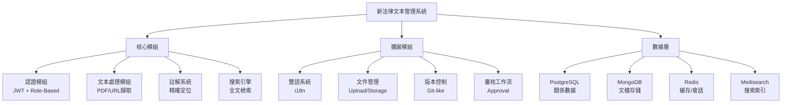

# 📚 法律文本管理系統 - 重新設計方案

> **版本**: v2.0  
> **日期**: 2025年1月  
> **基於**: 現有電子法典應用程式開發經驗  
> **設計原則**: 第一原理 + KISS原則 + SOLID原則

## 🎯 專案概述

### 核心目標
基於現有法律文本管理系統的開發經驗，重新設計一個更簡潔、模組化、可維護的解決方案，專注於：
- 🔐 **穩定的認證系統** (JWT + RBAC)
- 📄 **智能文本擷取** (URL/PDF處理)
- 🎯 **精確註解定位** (容錯算法)
- 🔍 **高效搜索引擎** (雙語全文檢索)

### 現有專案痛點分析
1. **架構混亂**: 目錄結構嵌套、循環依賴
2. **依賴過重**: 40+依賴包導致衝突
3. **配置複雜**: workspace配置引起腳本循環
4. **定位不準**: 註解定位算法不夠智能
5. **維護困難**: 缺乏模組化設計

## 🏗️ 整體架構設計

### 系統架構圖



### 設計原則
- **單一職責原則**: 每個模組只負責一個功能
- **開放封閉原則**: 對擴展開放，對修改封閉
- **依賴倒置原則**: 高層模組不依賴低層模組
- **接口隔離原則**: 使用小而專一的接口
- **最少知識原則**: 模組間降低耦合度

## 🔧 技術選型

### 後端技術棧
```typescript
// 推薦技術棧
{
  "framework": "Fastify + TypeScript",
  "database": "PostgreSQL + MongoDB (混合)",
  "orm": "Prisma (PostgreSQL) + Mongoose (MongoDB)",
  "cache": "Redis",
  "search": "Meilisearch",
  "auth": "JWT + Passport.js",
  "validation": "Zod",
  "testing": "Vitest + Supertest",
  "documentation": "OpenAPI 3.0 + Swagger UI"
}
```

### 前端技術棧
```typescript
{
  "framework": "Next.js 14 (App Router)",
  "language": "TypeScript",
  "styling": "Tailwind CSS + Headless UI",
  "state": "Zustand + TanStack Query",
  "forms": "React Hook Form + Zod",
  "editor": "Tiptap (現代化富文本編輯器)",
  "i18n": "next-intl",
  "testing": "Vitest + Testing Library",
  "pwa": "next-pwa"
}
```

## 📋 核心模組設計

### 1. 🔐 認證模組 (Auth Module)

#### 設計理念
- **安全第一**: JWT + Refresh Token 雙重保護
- **角色權限**: RBAC (Role-Based Access Control)
- **會話管理**: Redis 存儲會話狀態

#### 目錄結構
```
src/modules/auth/
├── controllers/
│   ├── AuthController.ts
│   └── UserController.ts
├── services/
│   ├── AuthService.ts
│   ├── TokenService.ts
│   └── RoleService.ts
├── middleware/
│   ├── authMiddleware.ts
│   └── rbacMiddleware.ts
├── types/
│   └── auth.types.ts
└── utils/
    ├── jwt.utils.ts
    └── crypto.utils.ts
```

#### 核心實現
```typescript
// services/AuthService.ts
export class AuthService {
  constructor(
    private userRepository: UserRepository,
    private tokenService: TokenService,
    private roleService: RoleService
  ) {}

  async login(credentials: LoginDto): Promise<AuthResult> {
    // 1. 驗證用戶憑證
    const user = await this.validateCredentials(credentials);
    
    // 2. 檢查用戶狀態
    this.validateUserStatus(user);
    
    // 3. 生成令牌
    const tokens = await this.tokenService.generateTokens(user);
    
    // 4. 記錄登入日誌
    await this.logLoginActivity(user);
    
    return { user, tokens };
  }

  async register(userData: RegisterDto): Promise<User> {
    // 1. 驗證註冊數據
    await this.validateRegistrationData(userData);
    
    // 2. 創建用戶
    const user = await this.userRepository.create({
      ...userData,
      password: await this.hashPassword(userData.password),
      status: 'pending_approval'
    });
    
    // 3. 分配默認角色
    await this.roleService.assignDefaultRole(user);
    
    // 4. 發送歡迎郵件
    await this.notificationService.sendWelcomeEmail(user);
    
    return user;
  }
}

// middleware/authMiddleware.ts
export const requireAuth = (permissions: Permission[] = []) => {
  return async (req: FastifyRequest, reply: FastifyReply) => {
    try {
      // 1. 提取令牌
      const token = extractToken(req);
      
      // 2. 驗證令牌
      const payload = await verifyToken(token);
      
      // 3. 獲取用戶信息
      const user = await getUserWithRoles(payload.userId);
      
      // 4. 檢查權限
      if (!hasPermissions(user, permissions)) {
        return reply.code(403).send({ error: 'Insufficient permissions' });
      }
      
      // 5. 設置用戶上下文
      req.user = user;
    } catch (error) {
      return reply.code(401).send({ error: 'Authentication failed' });
    }
  };
};
```

### 2. 📄 文本擷取模組 (Text Extraction Module)

#### 設計理念
- **策略模式**: 支持多種擷取策略 (URL, PDF, DOCX)
- **容錯處理**: 多層級容錯機制
- **性能優化**: 異步處理 + 進度追蹤

#### 目錄結構
```
src/modules/extraction/
├── services/
│   └── TextExtractionService.ts
├── strategies/
│   ├── URLExtractionStrategy.ts
│   ├── PDFExtractionStrategy.ts
│   └── DOCXExtractionStrategy.ts
├── extractors/
│   ├── MacauGovernmentExtractor.ts
│   ├── GenericWebExtractor.ts
│   └── LegalDocumentExtractor.ts
├── processors/
│   ├── ContentProcessor.ts
│   └── LanguageProcessor.ts
└── types/
    └── extraction.types.ts
```

#### 核心實現
```typescript
// services/TextExtractionService.ts
export class TextExtractionService {
  private strategies = new Map<string, ExtractionStrategy>();

  constructor() {
    this.registerStrategy('url', new URLExtractionStrategy());
    this.registerStrategy('pdf', new PDFExtractionStrategy());
    this.registerStrategy('docx', new DOCXExtractionStrategy());
  }

  async extract(source: ExtractionSource, options: ExtractionOptions = {}): Promise<ExtractionResult> {
    // 1. 選擇策略
    const strategy = this.getStrategy(source.type);
    
    // 2. 前置處理
    const preprocessedSource = await this.preprocessSource(source);
    
    // 3. 執行擷取
    const result = await strategy.extract(preprocessedSource, options);
    
    // 4. 後置處理
    return await this.postprocessResult(result, options);
  }

  private getStrategy(type: string): ExtractionStrategy {
    const strategy = this.strategies.get(type);
    if (!strategy) {
      throw new Error(`Unsupported extraction type: ${type}`);
    }
    return strategy;
  }
}

// strategies/URLExtractionStrategy.ts
export class URLExtractionStrategy implements ExtractionStrategy {
  async extract(source: URLSource, options: ExtractionOptions): Promise<ExtractionResult> {
    // 1. 檢測網站類型
    const siteType = this.detectSiteType(source.url);
    
    // 2. 選擇對應的擷取器
    const extractor = this.getExtractor(siteType);
    
    // 3. 執行擷取
    return await extractor.extract(source.url, options);
  }

  private detectSiteType(url: string): string {
    const patterns = {
      'macau-government': /bo\.io\.gov\.mo/,
      'hong-kong-legislation': /legislation\.gov\.hk/,
      'taiwan-law': /law\.moj\.gov\.tw/,
      'generic': /.*/
    };

    for (const [type, pattern] of Object.entries(patterns)) {
      if (pattern.test(url)) {
        return type;
      }
    }
    
    return 'generic';
  }
}

// extractors/MacauGovernmentExtractor.ts
export class MacauGovernmentExtractor implements WebExtractor {
  async extract(url: string, options: ExtractionOptions): Promise<ExtractionResult> {
    try {
      // 1. 獲取網頁內容
      const response = await this.fetchContent(url);
      const $ = cheerio.load(response.data);
      
      // 2. 移除無關元素
      this.removeUnwantedElements($);
      
      // 3. 擷取結構化數據
      const structuredData = this.extractStructuredData($, url);
      
      // 4. 處理雙語內容
      const bilingualContent = this.processBilingualContent(structuredData, options);
      
      return {
        success: true,
        data: bilingualContent,
        metadata: {
          sourceUrl: url,
          extractedAt: new Date(),
          extractor: 'MacauGovernmentExtractor',
          confidence: this.calculateConfidence(bilingualContent)
        }
      };
    } catch (error) {
      throw new ExtractionError(`Macau government extraction failed: ${error.message}`);
    }
  }

  private extractStructuredData($: CheerioAPI, url: string): StructuredData {
    // 法律編號擷取
    const lawNumber = this.extractLawNumber($);
    
    // 標題擷取
    const title = this.extractTitle($);
    
    // 內容擷取 (精確範圍：h2 到 hr)
    const content = this.extractContent($);
    
    return { lawNumber, title, content };
  }
}
```

### 3. 🎯 註解定位系統 (Annotation Positioning System)

#### 設計理念
- **多層定位**: 絕對位置 + 相對位置 + 結構位置
- **智能匹配**: 容錯算法處理文本變化
- **性能優化**: 索引 + 緩存機制

#### 目錄結構
```
src/modules/annotation/
├── services/
│   ├── AnnotationService.ts
│   └── PositionService.ts
├── algorithms/
│   ├── TextMatchingAlgorithm.ts
│   ├── ContextAnalyzer.ts
│   └── StructuralAnalyzer.ts
├── types/
│   └── annotation.types.ts
└── utils/
    ├── textUtils.ts
    └── hashUtils.ts
```

#### 核心算法
```typescript
// services/PositionService.ts
export class PositionService {
  constructor(
    private textMatchingAlgorithm: TextMatchingAlgorithm,
    private contextAnalyzer: ContextAnalyzer,
    private structuralAnalyzer: StructuralAnalyzer
  ) {}

  async calculatePosition(textId: string, selectionData: SelectionData): Promise<AnnotationPosition> {
    const { selectedText, startOffset, endOffset, contextBefore, contextAfter } = selectionData;

    return {
      // 主要定位：絕對偏移量
      primary: {
        startOffset,
        endOffset,
        selectedText
      },

      // 輔助定位：上下文信息
      context: {
        before: contextBefore.slice(-50),
        after: contextAfter.slice(0, 50),
        hash: this.generateContextHash(contextBefore, selectedText, contextAfter)
      },

      // 結構定位：段落/章節信息
      structural: await this.structuralAnalyzer.analyze(textId, startOffset, endOffset),

      // 備用定位：文本指紋
      fingerprint: this.generateTextFingerprint(selectedText, contextBefore, contextAfter),

      // 元數據
      metadata: {
        createdAt: new Date(),
        textLength: selectedText.length,
        confidence: this.calculatePositionConfidence(selectionData)
      }
    };
  }

  async findAnnotationPosition(textContent: string, position: AnnotationPosition): Promise<TextRange | null> {
    // 多策略定位 (按優先級)
    const strategies = [
      () => this.findByPrimaryPosition(textContent, position),
      () => this.findByContextMatch(textContent, position),
      () => this.findByTextFingerprint(textContent, position),
      () => this.findByStructuralPath(textContent, position),
      () => this.findByFuzzyMatch(textContent, position)
    ];

    for (const strategy of strategies) {
      try {
        const result = await strategy();
        if (result && this.validatePosition(result, position)) {
          return result;
        }
      } catch (error) {
        console.warn(`定位策略失敗: ${error.message}`);
        continue;
      }
    }

    return null; // 所有策略都失敗
  }

  private generateTextFingerprint(selectedText: string, contextBefore: string, contextAfter: string): string {
    // 使用滑動窗口算法生成文本指紋
    const combined = contextBefore + selectedText + contextAfter;
    const words = combined.split(/\s+/).filter(word => word.length > 2);
    
    // 生成3-gram指紋
    const trigrams = [];
    for (let i = 0; i < words.length - 2; i++) {
      trigrams.push(words.slice(i, i + 3).join(' '));
    }
    
    return this.hashUtil.sha256(trigrams.join('|'));
  }
}

// algorithms/TextMatchingAlgorithm.ts
export class TextMatchingAlgorithm {
  async findByContextMatch(textContent: string, position: AnnotationPosition): Promise<TextRange | null> {
    const { context, primary } = position;
    
    // 1. 尋找上下文匹配
    const contextPattern = this.buildContextPattern(context);
    const matches = this.findMatches(textContent, contextPattern);
    
    if (matches.length === 0) {
      return null;
    }
    
    // 2. 如果有多個匹配，使用啟發式算法選擇最佳匹配
    const bestMatch = this.selectBestMatch(matches, position);
    
    // 3. 在匹配範圍內定位具體文本
    return this.locateExactText(textContent, bestMatch, primary.selectedText);
  }

  private buildContextPattern(context: ContextInfo): RegExp {
    const before = this.escapeRegex(context.before);
    const after = this.escapeRegex(context.after);
    
    // 建立寬鬆的匹配模式，允許輕微變化
    return new RegExp(
      `${before}.{0,100}${after}`,
      'gi'
    );
  }

  private selectBestMatch(matches: TextMatch[], position: AnnotationPosition): TextMatch {
    // 使用多個因子計算匹配度
    return matches.reduce((best, current) => {
      const bestScore = this.calculateMatchScore(best, position);
      const currentScore = this.calculateMatchScore(current, position);
      return currentScore > bestScore ? current : best;
    });
  }

  private calculateMatchScore(match: TextMatch, position: AnnotationPosition): number {
    let score = 0;
    
    // 位置相似度 (30%)
    score += this.calculatePositionSimilarity(match, position) * 0.3;
    
    // 文本相似度 (40%)
    score += this.calculateTextSimilarity(match, position) * 0.4;
    
    // 上下文相似度 (30%)
    score += this.calculateContextSimilarity(match, position) * 0.3;
    
    return score;
  }
}
```

### 4. 🔍 搜索引擎模組 (Search Engine Module)

#### 設計理念
- **責任鏈模式**: 查詢處理管道
- **多引擎支持**: PostgreSQL全文搜索 + Meilisearch
- **智能排序**: 相關性 + 權重算法

#### 目錄結構
```
src/modules/search/
├── services/
│   └── SearchService.ts
├── processors/
│   ├── QueryNormalizationProcessor.ts
│   ├── LanguageDetectionProcessor.ts
│   ├── SynonymExpansionProcessor.ts
│   └── ResultRankingProcessor.ts
├── engines/
│   ├── PostgreSQLSearchEngine.ts
│   └── MeilisearchEngine.ts
└── types/
    └── search.types.ts
```

#### 核心實現
```typescript
// services/SearchService.ts
export class SearchService {
  private processors: SearchProcessor[];
  private engines: Map<string, SearchEngine>;

  constructor() {
    this.processors = [
      new QueryNormalizationProcessor(),
      new LanguageDetectionProcessor(),
      new SynonymExpansionProcessor(),
      new FuzzyMatchProcessor(),
      new ResultRankingProcessor()
    ];

    this.engines = new Map([
      ['postgresql', new PostgreSQLSearchEngine()],
      ['meilisearch', new MeilisearchEngine()]
    ]);
  }

  async search(query: string, options: SearchOptions = {}): Promise<SearchResult> {
    // 1. 初始化搜索上下文
    let context: SearchContext = {
      originalQuery: query,
      normalizedQuery: query,
      language: options.language || 'auto',
      filters: options.filters || {},
      engines: options.engines || ['meilisearch', 'postgresql'],
      results: []
    };

    // 2. 責任鏈處理
    for (const processor of this.processors) {
      context = await processor.process(context);
    }

    // 3. 多引擎搜索
    const engineResults = await Promise.all(
      context.engines.map(engineName => {
        const engine = this.engines.get(engineName);
        return engine?.search(context) || Promise.resolve([]);
      })
    );

    // 4. 結果合併和排序
    const mergedResults = this.mergeResults(engineResults);
    const rankedResults = this.rankResults(mergedResults, context);

    return {
      query: context.originalQuery,
      results: rankedResults,
      metadata: {
        totalResults: rankedResults.length,
        searchTime: Date.now() - context.startTime,
        engines: context.engines,
        language: context.language
      }
    };
  }
}

// processors/LanguageDetectionProcessor.ts
export class LanguageDetectionProcessor implements SearchProcessor {
  async process(context: SearchContext): Promise<SearchContext> {
    if (context.language === 'auto') {
      context.detectedLanguage = await this.detectLanguage(context.normalizedQuery);
      context.language = context.detectedLanguage;
    }

    return context;
  }

  private async detectLanguage(text: string): Promise<'zh' | 'pt' | 'en'> {
    // 使用字符特徵檢測語言
    const chineseChars = (text.match(/[\u4e00-\u9fff]/g) || []).length;
    const portugueseChars = (text.match(/[àáâãçéêíóôõú]/gi) || []).length;
    const totalChars = text.length;

    const chineseRatio = chineseChars / totalChars;
    const portugueseRatio = portugueseChars / totalChars;

    if (chineseRatio > 0.3) return 'zh';
    if (portugueseRatio > 0.1) return 'pt';
    return 'en';
  }
}

// engines/MeilisearchEngine.ts
export class MeilisearchEngine implements SearchEngine {
  constructor(private client: MeiliSearch) {}

  async search(context: SearchContext): Promise<SearchResult[]> {
    const { normalizedQuery, filters, language } = context;

    try {
      const searchParams: SearchParams = {
        q: normalizedQuery,
        limit: 50,
        attributesToHighlight: ['title', 'content'],
        filter: this.buildFilters(filters),
        sort: ['_rankingScore:desc', 'publicationDate:desc']
      };

      const results = await this.client
        .index('legal_texts')
        .search(searchParams);

      return results.hits.map(hit => this.transformResult(hit));
    } catch (error) {
      console.error('Meilisearch error:', error);
      return [];
    }
  }

  private buildFilters(filters: SearchFilters): string[] {
    const filterExpressions: string[] = [];

    if (filters.category) {
      filterExpressions.push(`category = "${filters.category}"`);
    }

    if (filters.language) {
      filterExpressions.push(`language = "${filters.language}"`);
    }

    if (filters.dateRange) {
      const { start, end } = filters.dateRange;
      filterExpressions.push(`publicationDate ${start} TO ${end}`);
    }

    return filterExpressions;
  }
}
```

## 📊 數據庫設計

### 混合存儲架構

#### PostgreSQL (關係數據)
```sql
-- 用戶和權限
CREATE TABLE users (
    id UUID PRIMARY KEY DEFAULT gen_random_uuid(),
    username VARCHAR(50) UNIQUE NOT NULL,
    email VARCHAR(255) UNIQUE NOT NULL,
    password_hash VARCHAR(255) NOT NULL,
    status user_status DEFAULT 'pending_approval',
    created_at TIMESTAMP DEFAULT NOW(),
    updated_at TIMESTAMP DEFAULT NOW()
);

CREATE TABLE roles (
    id UUID PRIMARY KEY DEFAULT gen_random_uuid(),
    name VARCHAR(50) UNIQUE NOT NULL,
    description TEXT,
    permissions JSONB NOT NULL
);

CREATE TABLE user_roles (
    user_id UUID REFERENCES users(id),
    role_id UUID REFERENCES roles(id),
    granted_at TIMESTAMP DEFAULT NOW(),
    PRIMARY KEY (user_id, role_id)
);

-- 法律文本元數據
CREATE TABLE legal_texts (
    id UUID PRIMARY KEY DEFAULT gen_random_uuid(),
    title_zh VARCHAR(500) NOT NULL,
    title_pt VARCHAR(500),
    law_number VARCHAR(100),
    category VARCHAR(100),
    publication_date DATE,
    content_id VARCHAR(50), -- MongoDB ObjectId
    source_url TEXT,
    hash VARCHAR(64) UNIQUE, -- 防重複
    author_id UUID REFERENCES users(id),
    is_public BOOLEAN DEFAULT false,
    status text_status DEFAULT 'draft',
    created_at TIMESTAMP DEFAULT NOW(),
    updated_at TIMESTAMP DEFAULT NOW()
);

-- 索引優化
CREATE INDEX idx_legal_texts_title_zh ON legal_texts USING gin(to_tsvector('chinese', title_zh));
CREATE INDEX idx_legal_texts_title_pt ON legal_texts USING gin(to_tsvector('portuguese', title_pt));
CREATE INDEX idx_legal_texts_category ON legal_texts(category);
CREATE INDEX idx_legal_texts_publication_date ON legal_texts(publication_date);
```

#### MongoDB (文檔內容)
```typescript
// LegalTextContent Collection
interface LegalTextContent {
  _id: ObjectId;
  textId: string; // PostgreSQL UUID
  content: {
    zh?: {
      text: string;
      html: string;
      wordCount: number;
    };
    pt?: {
      text: string;
      html: string;
      wordCount: number;
    };
  };
  structure: {
    chapters: Chapter[];
    articles: Article[];
    sections: Section[];
  };
  metadata: {
    extractionMethod: 'manual' | 'url' | 'pdf' | 'docx';
    sourceUrl?: string;
    extractedAt?: Date;
    lastModified: Date;
  };
}

// Annotation Collection
interface Annotation {
  _id: ObjectId;
  textId: string; // PostgreSQL UUID
  authorId: string; // PostgreSQL UUID
  position: {
    startOffset: number;
    endOffset: number;
    selectedText: string;
    contextHash: string;
    structuralPath?: string;
  };
  content: {
    text: string;
    html?: string;
    type: AnnotationType;
  };
  status: 'draft' | 'pending' | 'approved' | 'rejected';
  isPublic: boolean;
  createdAt: Date;
  updatedAt: Date;
}
```

## 🚀 實施策略

### 第一階段：基礎架構 (第1-2週)

#### 專案初始化
```bash
# 1. 創建專案目錄
mkdir legal-codex-v2
cd legal-codex-v2

# 2. 初始化前後端專案
mkdir apps packages
cd apps

# 後端 (Fastify + TypeScript)
mkdir api
cd api
npm init -y
npm install fastify @fastify/cors @fastify/jwt @fastify/multipart
npm install -D typescript @types/node tsx vitest

# 前端 (Next.js 14)
cd ../
npx create-next-app@latest web --typescript --tailwind --app
cd web
npm install @tanstack/react-query zustand @headlessui/react

# 3. Monorepo 配置 (pnpm workspace)
cd ../../
echo "packages:\n  - 'apps/*'\n  - 'packages/*'" > pnpm-workspace.yaml
```

#### 基礎配置文件
```typescript
// apps/api/src/config/database.ts
export const databaseConfig = {
  postgresql: {
    host: process.env.PG_HOST || 'localhost',
    port: parseInt(process.env.PG_PORT || '5432'),
    database: process.env.PG_DATABASE || 'legal_codex_v2',
    username: process.env.PG_USERNAME || 'postgres',
    password: process.env.PG_PASSWORD || 'password'
  },
  mongodb: {
    uri: process.env.MONGO_URI || 'mongodb://localhost:27017/legal_codex_v2'
  },
  redis: {
    host: process.env.REDIS_HOST || 'localhost',
    port: parseInt(process.env.REDIS_PORT || '6379')
  }
};

// apps/api/src/app.ts
import Fastify from 'fastify';
import cors from '@fastify/cors';
import jwt from '@fastify/jwt';

export async function buildApp() {
  const app = Fastify({
    logger: true
  });

  // 註冊插件
  await app.register(cors, {
    origin: process.env.NODE_ENV === 'production' 
      ? ['https://your-domain.com'] 
      : true
  });

  await app.register(jwt, {
    secret: process.env.JWT_SECRET || 'supersecret'
  });

  // 註冊路由
  await app.register(authRoutes, { prefix: '/api/auth' });
  await app.register(textRoutes, { prefix: '/api/texts' });
  await app.register(annotationRoutes, { prefix: '/api/annotations' });
  await app.register(searchRoutes, { prefix: '/api/search' });

  return app;
}
```

### 第二階段：核心功能 (第3-5週)

#### 實施優先級
1. **認證系統** (第3週)
   - JWT實現
   - RBAC權限控制
   - 用戶註冊審批

2. **文本擷取** (第4週)
   - URL擷取策略
   - PDF處理 (pdf-parse)
   - 內容標準化

3. **註解系統** (第5週)
   - 多層定位算法
   - 容錯機制
   - 性能優化

#### 測試策略
```typescript
// 測試配置
// vitest.config.ts
export default defineConfig({
  test: {
    environment: 'node',
    globals: true,
    setupFiles: ['./tests/setup.ts']
  }
});

// 集成測試示例
// tests/integration/auth.test.ts
describe('Authentication', () => {
  test('should login successfully with valid credentials', async () => {
    const response = await app.inject({
      method: 'POST',
      url: '/api/auth/login',
      payload: {
        email: 'test@example.com',
        password: 'password123'
      }
    });

    expect(response.statusCode).toBe(200);
    expect(response.json()).toHaveProperty('token');
  });
});
```

### 第三階段：高級功能 (第6-8週)

#### 功能清單
1. **雙語系統整合**
2. **高級搜索引擎**
3. **工作流審核**
4. **性能優化**
5. **部署配置**

## 📈 性能優化策略

### 1. 數據庫優化
```sql
-- 分區表 (按年份分區)
CREATE TABLE legal_texts_y2024 PARTITION OF legal_texts
    FOR VALUES FROM ('2024-01-01') TO ('2025-01-01');

-- 物化視圖 (搜索優化)
CREATE MATERIALIZED VIEW search_index AS
SELECT 
    lt.id,
    lt.title_zh,
    lt.title_pt,
    lt.category,
    ltc.content->'zh'->>'text' as content_zh,
    ltc.content->'pt'->>'text' as content_pt,
    to_tsvector('chinese', lt.title_zh || ' ' || COALESCE(ltc.content->'zh'->>'text', '')) as search_vector_zh,
    to_tsvector('portuguese', COALESCE(lt.title_pt, '') || ' ' || COALESCE(ltc.content->'pt'->>'text', '')) as search_vector_pt
FROM legal_texts lt
LEFT JOIN legal_text_contents ltc ON lt.content_id = ltc._id::text;

CREATE INDEX idx_search_vector_zh ON search_index USING gin(search_vector_zh);
CREATE INDEX idx_search_vector_pt ON search_index USING gin(search_vector_pt);
```

### 2. 緩存策略
```typescript
// 多層級緩存
export class CacheService {
  constructor(
    private redis: Redis,
    private memoryCache: LRUCache<string, any>
  ) {}

  async get<T>(key: string): Promise<T | null> {
    // L1: 內存緩存
    const memoryResult = this.memoryCache.get(key);
    if (memoryResult) return memoryResult;

    // L2: Redis緩存
    const redisResult = await this.redis.get(key);
    if (redisResult) {
      const parsed = JSON.parse(redisResult);
      this.memoryCache.set(key, parsed);
      return parsed;
    }

    return null;
  }

  async set(key: string, value: any, ttl: number = 3600): Promise<void> {
    // 同時寫入兩級緩存
    this.memoryCache.set(key, value);
    await this.redis.setex(key, ttl, JSON.stringify(value));
  }
}
```

### 3. 前端性能優化
```typescript
// 懶加載和代碼分割
const LegalTextEditor = lazy(() => import('./components/LegalTextEditor'));
const AnnotationViewer = lazy(() => import('./components/AnnotationViewer'));

// 虛擬滾動 (大列表優化)
import { FixedSizeList as List } from 'react-window';

const VirtualizedTextList = ({ texts }: { texts: LegalText[] }) => (
  <List
    height={600}
    itemCount={texts.length}
    itemSize={100}
    itemData={texts}
  >
    {({ index, style, data }) => (
      <div style={style}>
        <TextListItem text={data[index]} />
      </div>
    )}
  </List>
);
```

## 🐳 部署方案

### Docker Compose 配置
```yaml
# docker-compose.yml
version: '3.8'

services:
  # 前端
  web:
    build: ./apps/web
    ports:
      - "3000:3000"
    environment:
      - NEXT_PUBLIC_API_URL=http://localhost:5000
    depends_on:
      - api

  # 後端API
  api:
    build: ./apps/api
    ports:
      - "5000:5000"
    environment:
      - NODE_ENV=production
      - JWT_SECRET=${JWT_SECRET}
      - PG_HOST=postgres
      - MONGO_URI=mongodb://mongo:27017/legal_codex_v2
      - REDIS_HOST=redis
    depends_on:
      - postgres
      - mongo
      - redis
      - meilisearch

  # PostgreSQL
  postgres:
    image: postgres:15-alpine
    environment:
      POSTGRES_DB: legal_codex_v2
      POSTGRES_USER: postgres
      POSTGRES_PASSWORD: ${POSTGRES_PASSWORD}
    volumes:
      - postgres_data:/var/lib/postgresql/data
      - ./sql/init.sql:/docker-entrypoint-initdb.d/init.sql

  # MongoDB
  mongo:
    image: mongo:7
    volumes:
      - mongo_data:/data/db

  # Redis
  redis:
    image: redis:7-alpine
    volumes:
      - redis_data:/data

  # Meilisearch
  meilisearch:
    image: getmeili/meilisearch:v1.5
    environment:
      - MEILI_MASTER_KEY=${MEILI_MASTER_KEY}
    volumes:
      - meili_data:/meili_data

  # Nginx (生產環境)
  nginx:
    image: nginx:alpine
    ports:
      - "80:80"
      - "443:443"
    volumes:
      - ./nginx/nginx.conf:/etc/nginx/nginx.conf
      - ./nginx/ssl:/etc/nginx/ssl
    depends_on:
      - web
      - api

volumes:
  postgres_data:
  mongo_data:
  redis_data:
  meili_data:
```

### CI/CD 流程
```yaml
# .github/workflows/deploy.yml
name: Deploy to Production

on:
  push:
    branches: [main]

jobs:
  test:
    runs-on: ubuntu-latest
    steps:
      - uses: actions/checkout@v4
      - uses: actions/setup-node@v4
        with:
          node-version: '20'
      - run: npm install
      - run: npm run test
      - run: npm run build

  deploy:
    needs: test
    runs-on: ubuntu-latest
    steps:
      - uses: actions/checkout@v4
      - name: Deploy to server
        run: |
          docker-compose down
          docker-compose pull
          docker-compose up -d
```

## 📝 開發規範

### 1. 代碼規範
```typescript
// ESLint + Prettier 配置
// .eslintrc.js
module.exports = {
  extends: [
    '@typescript-eslint/recommended',
    'prettier'
  ],
  rules: {
    '@typescript-eslint/no-unused-vars': 'error',
    '@typescript-eslint/explicit-function-return-type': 'warn',
    'prefer-const': 'error'
  }
};
```

### 2. Git 工作流
```bash
# 分支命名規範
feature/auth-module
bugfix/annotation-positioning
hotfix/security-vulnerability

# 提交信息規範
feat: 添加JWT認證功能
fix: 修復註解定位算法
docs: 更新API文檔
test: 添加文本擷取測試
```

### 3. API 設計規範
```typescript
// OpenAPI 3.0 文檔
export const apiSpec = {
  openapi: '3.0.0',
  info: {
    title: 'Legal Codex API',
    version: '2.0.0',
    description: '法律文本管理系統API'
  },
  paths: {
    '/api/auth/login': {
      post: {
        summary: '用戶登入',
        requestBody: {
          required: true,
          content: {
            'application/json': {
              schema: {
                type: 'object',
                properties: {
                  email: { type: 'string', format: 'email' },
                  password: { type: 'string', minLength: 8 }
                },
                required: ['email', 'password']
              }
            }
          }
        },
        responses: {
          200: {
            description: '登入成功',
            content: {
              'application/json': {
                schema: {
                  type: 'object',
                  properties: {
                    success: { type: 'boolean' },
                    data: {
                      type: 'object',
                      properties: {
                        user: { $ref: '#/components/schemas/User' },
                        token: { type: 'string' },
                        refreshToken: { type: 'string' }
                      }
                    }
                  }
                }
              }
            }
          }
        }
      }
    }
  }
};
```

## 🔒 安全考量

### 1. 認證安全
- JWT + Refresh Token 雙重保護
- 密碼強度要求 + bcrypt 加密
- 會話管理 + 自動過期
- 多因素認證 (MFA) 支持

### 2. 數據安全
- SQL 注入防護 (參數化查詢)
- XSS 防護 (內容消毒)
- CSRF 防護 (CSRF Token)
- 敏感數據加密存儲

### 3. API 安全
- Rate Limiting (防止濫用)
- CORS 配置
- HTTPS 強制
- API 版本控制

## 📊 監控和日誌

### 1. 應用監控
```typescript
// 健康檢查端點
app.get('/health', async (request, reply) => {
  const health = {
    status: 'ok',
    timestamp: new Date().toISOString(),
    services: {
      postgresql: await checkPostgreSQL(),
      mongodb: await checkMongoDB(),
      redis: await checkRedis(),
      meilisearch: await checkMeilisearch()
    }
  };

  const allHealthy = Object.values(health.services).every(status => status === 'ok');
  
  return reply
    .code(allHealthy ? 200 : 503)
    .send(health);
});
```

### 2. 日誌管理
```typescript
// 結構化日誌
import winston from 'winston';

export const logger = winston.createLogger({
  level: 'info',
  format: winston.format.combine(
    winston.format.timestamp(),
    winston.format.errors({ stack: true }),
    winston.format.json()
  ),
  transports: [
    new winston.transports.File({ filename: 'logs/error.log', level: 'error' }),
    new winston.transports.File({ filename: 'logs/combined.log' }),
    new winston.transports.Console({
      format: winston.format.simple()
    })
  ]
});
```

## 🔄 遷移策略

### 從現有系統遷移
1. **數據導出**: 從 MongoDB 導出現有數據
2. **數據清理**: 標準化和去重
3. **結構轉換**: 適配新的數據模式
4. **增量同步**: 遷移期間的數據同步
5. **切換時間**: 選擇業務低峰期

### 遷移腳本示例
```typescript
// scripts/migrate-from-v1.ts
export class LegacyDataMigrator {
  async migrate(): Promise<void> {
    console.log('開始數據遷移...');

    // 1. 遷移用戶數據
    await this.migrateUsers();
    
    // 2. 遷移法律文本
    await this.migrateLegalTexts();
    
    // 3. 遷移註解數據
    await this.migrateAnnotations();
    
    // 4. 重建搜索索引
    await this.rebuildSearchIndex();

    console.log('數據遷移完成！');
  }

  private async migrateLegalTexts(): Promise<void> {
    const legacyTexts = await this.legacyDb.collection('legaltexts').find({}).toArray();
    
    for (const legacyText of legacyTexts) {
      // 轉換數據結構
      const newText = this.transformLegalText(legacyText);
      
      // 保存到新系統
      await this.newDb.legalTexts.create(newText);
    }
  }
}
```

## 📚 文檔和培訓

### 1. 技術文檔
- API 文檔 (OpenAPI/Swagger)
- 數據庫設計文檔
- 部署指南
- 故障排除指南

### 2. 用戶文檔
- 用戶使用手冊
- 管理員指南
- 常見問題解答
- 視頻教程

### 3. 開發文檔
- 代碼規範
- Git 工作流
- 測試策略
- 性能優化指南

## 🏁 總結

這個重新設計方案基於您現有專案的經驗教訓，採用了更現代、更可維護的架構：

### 核心改進
1. **模組化設計**: 每個功能獨立模組，降低耦合
2. **技術現代化**: TypeScript + 現代框架
3. **性能優化**: 混合數據庫 + 多級緩存
4. **開發體驗**: 完整的工具鏈和規範

### 實施建議
1. **循序漸進**: 按階段實施，每階段都有可交付成果
2. **測試驅動**: 每個模組都有完整測試覆蓋
3. **文檔先行**: 邊開發邊完善文檔
4. **性能監控**: 從第一天就建立監控體系

這個方案既保留了您現有系統的核心功能，又解決了架構混亂、依賴過重等問題。相信能為您的新專案提供一個穩固的基礎。

---

**文檔版本**: v1.0  
**最後更新**: 2025年1月  
**維護者**: 獨立開發者 